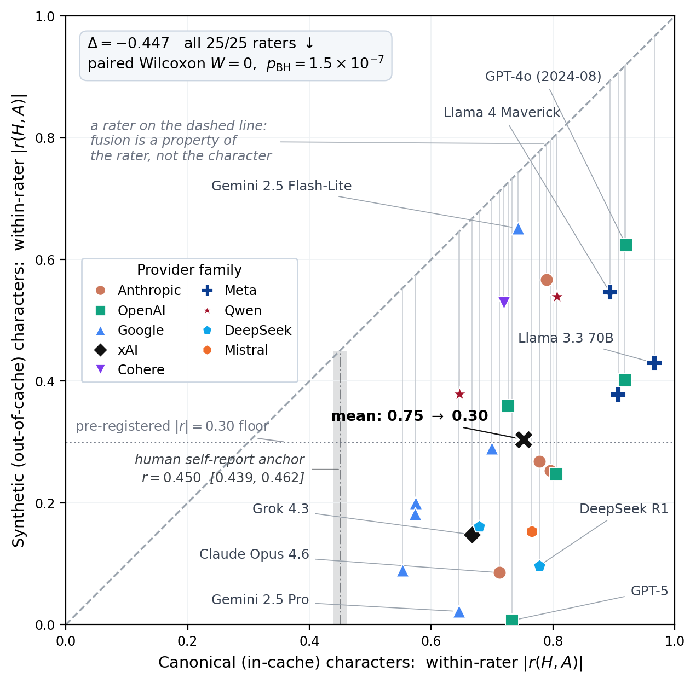

# The Catcher in the Cache: Retrieval, Not Measurement, in LLM Personality Inference

[](https://www.python.org/downloads/release/python-3120/)
[](LICENSE)
[](LICENSE-DATA)
[](#citation)
[](CATCHER.md)

This is the companion repository for *The Catcher in the Cache* (ACM TIST). It contains the notebooks, data artifacts, and explainers needed to reproduce the paper's claims, in Experiment order.

**New here?** The paper in five minutes: [`docs/explainers/reading_guide.md`](docs/explainers/reading_guide.md). Want to score your own characters: [`docs/practitioners_guide.md`](docs/practitioners_guide.md).

**Run any notebook in Colab, no install required:**

[](https://colab.research.google.com/github/Wildertrek/catcher-in-the-cache/blob/main/notebooks/01_quick_start.ipynb) [](https://colab.research.google.com/github/Wildertrek/catcher-in-the-cache/blob/main/notebooks/02_method_bakeoff_results.ipynb) [](https://colab.research.google.com/github/Wildertrek/catcher-in-the-cache/blob/main/notebooks/03_hexaco_atlas_reproducer.ipynb) [](https://colab.research.google.com/github/Wildertrek/catcher-in-the-cache/blob/main/notebooks/09_catcher_in_the_cache.ipynb) [](https://colab.research.google.com/github/Wildertrek/catcher-in-the-cache/blob/main/notebooks/05_cache_map.ipynb)

These five are the guided entry points; the reproduction map below carries a Colab badge for every one of the ten notebooks.

## Thesis



On canonical literary characters, LLM personality rating is largely **retrieval against a memorized character prior**, not **measurement from the text**. The two are indistinguishable on famous characters, where both give the same answer, but decisive for any system expected to generalize to characters a model has never seen. We establish the effect with one instrument used twice: a 25-rater panel reproduces a structure known from human psychometrics (the Honesty-Humility / Agreeableness conflation), and that same structure collapses on 20 synthetic out-of-corpus characters. A cache-membership gauge separates the two populations almost perfectly (AUC 0.99).

## Reproduction map: Experiment to RQ to notebook

**APERTURE** (Automated PERsonality TUning, Representation, and Evaluation) is the multi-method, multi-rater diagnostic system the paper introduces; this repository is its paper-scoped public companion. Method codes M1-M6, the three-bar validity protocol, and all other terms are decoded in [`docs/appendix/glossary.md`](docs/appendix/glossary.md).

Every notebook runs at \$0. Notebooks 02-10 run from cached artifacts with no API keys; notebook 01 (the entry demo) makes live inference calls, and with no provider keys set it falls back to an open-weight rater (Qwen2.5-1.5B-Instruct) so it stays free too; keys are optional and enable the full multi-provider consensus. Open any notebook in Colab via its badge, or run locally (see [Quickstart](#quickstart)).

| Experiment / analysis | Research questions | Notebook | Run |
|---|---|---|---|
| Entry point | live consensus-inference demo on Pride &amp; Prejudice <em>(API keys optional: with none set it falls back to an open-weight rater; $0 headline reproducers are notebooks 03 and 09)</em> | [`01_quick_start`](notebooks/01_quick_start.ipynb) | [](https://colab.research.google.com/github/Wildertrek/catcher-in-the-cache/blob/main/notebooks/01_quick_start.ipynb) |
| **Experiment 1**: method comparison and construct validity | RQ1.1-RQ1.7 (leaderboard, MTMM convergence, external validity, per-trait verdict, construct-space head-to-head) | [`02_method_bakeoff_results`](notebooks/02_method_bakeoff_results.ipynb) | [](https://colab.research.google.com/github/Wildertrek/catcher-in-the-cache/blob/main/notebooks/02_method_bakeoff_results.ipynb) |
| **Experiment 2**: the cross-rater HEXACO panel | RQ2.1-RQ2.3 (fusion universal across 25 raters, family clustering, alignment regime) | [`03_hexaco_atlas_reproducer`](notebooks/03_hexaco_atlas_reproducer.ipynb) | [](https://colab.research.google.com/github/Wildertrek/catcher-in-the-cache/blob/main/notebooks/03_hexaco_atlas_reproducer.ipynb) |
| **Experiment 3**: the out-of-corpus substrate | RQ3.1 (collapse off-cache, &Delta; = -0.447; signed-r discriminator via [`compute_signed_r.py`](paper_artifacts/pivot6_hexaco_atlas/compute_signed_r.py)) | [`03_hexaco_atlas_reproducer`](notebooks/03_hexaco_atlas_reproducer.ipynb) (reproducer), [`04_synthetic_characters`](notebooks/04_synthetic_characters.ipynb) (data card) | [](https://colab.research.google.com/github/Wildertrek/catcher-in-the-cache/blob/main/notebooks/04_synthetic_characters.ipynb) |
| **Experiment 3**: the cache-membership gauge | RQ3.2 (separates in/out of corpus, AUC 0.99) | [`05_cache_map`](notebooks/05_cache_map.ipynb) | [](https://colab.research.google.com/github/Wildertrek/catcher-in-the-cache/blob/main/notebooks/05_cache_map.ipynb) |
| Experiment 3 robustness (appendix) | register-matched substrate control | [`06_register_matched_synth`](notebooks/06_register_matched_synth.ipynb) | [](https://colab.research.google.com/github/Wildertrek/catcher-in-the-cache/blob/main/notebooks/06_register_matched_synth.ipynb) |
| Experiment 3 human anchor (appendix) | same-instrument IPIP-HEXACO persona self-report | [`07_ipip_human_anchor`](notebooks/07_ipip_human_anchor.ipynb) | [](https://colab.research.google.com/github/Wildertrek/catcher-in-the-cache/blob/main/notebooks/07_ipip_human_anchor.ipynb) |
| Further analysis, mechanism | activation probe over 12 open-weight models (early-layer fusion) | [`08_activation_probe_dissociation`](notebooks/08_activation_probe_dissociation.ipynb), [`09_catcher_in_the_cache`](notebooks/09_catcher_in_the_cache.ipynb) | [](https://colab.research.google.com/github/Wildertrek/catcher-in-the-cache/blob/main/notebooks/08_activation_probe_dissociation.ipynb) |
| Supporting (S1) + label propagation | cost-accuracy frontier; regressor inherits the fusion (LOBO MAE 0.312) | [`10_regressor_inference`](notebooks/10_regressor_inference.ipynb) | [](https://colab.research.google.com/github/Wildertrek/catcher-in-the-cache/blob/main/notebooks/10_regressor_inference.ipynb) |

The pre-registration crosswalk and the disposition of merged/retracted questions are in [`docs/explainers/rq_decoder.md`](docs/explainers/rq_decoder.md). A guided walk-through of the central result is in [`docs/explainers/the_catch_explained.md`](docs/explainers/the_catch_explained.md), and a plain-language numbers decoder is in [`docs/explainers/numbers_decoder.md`](docs/explainers/numbers_decoder.md). If you find an artifact here describing the panel as 26, 27 or 28 raters rather than 25, [`docs/explainers/panel_roster_history.md`](docs/explainers/panel_roster_history.md) reconciles every count and says who was excluded and why. Method codes (M1-M6) are decoded with worked examples in [`docs/explainers/method_zoo.md`](docs/explainers/method_zoo.md), and the paper's companion-appendix pointers (§A.1-A.15) map to [`docs/appendix/README.md`](docs/appendix/README.md).

## Repository layout

```
notebooks/            10 reproduction notebooks (Experiment order above)
paper_artifacts/
  method_bakeoff_v4/  six-method comparison: predictions, embeddings, per-character CSVs, M1 reproducer
  pivot6_hexaco_atlas/ 25-rater panel ratings, cache-map and catcher viz data,
                       synthetic + register-matched + IPIP substrates, activation-probe summaries
  hexaco6_head_to_head/ construct-space head-to-head (HEXACO / OCEAN-6 / OCEAN-HP)
  notebook04_lobo/    leave-one-book-out splits for the regressor
data/aperture-data-v1/  canonical versioned data bundle: ground_truth/ (76 books),
                      indices/ (Pride and Prejudice worked example), regressors/
                      (1536-d Ridge head + LOBO results)
data/ground_truth/    convenience mirror of data/aperture-data-v1/ground_truth/ (byte-identical)
pillar1/              ground-truth schema, consensus runner, and metrics used by the pipeline
human_panel/          human-rater panel kit: pre-registration, design, deployment guide,
                      and the Colab rating notebook
personality_models/   deployable Ridge regressor heads (OCEAN-HP cheap regressor + HEXACO heads); the M1 reproducer is method_bakeoff_v4/m1_baseline.py
docs/explainers/      plain-language companions to every result
docs/appendix/ detailed in-companion appendix tables (MTMM, per-rater, SCPI, calibration)
docs/figures/         figure-reproduction pointers
CATCHER.md            the Salinger allusion: what the title claims and does not claim
```

> **Ground-truth duplication.** `data/aperture-data-v1/` is the canonical versioned data bundle; `data/ground_truth/` is a byte-identical convenience mirror kept at the shorter path for notebooks that expect it.

> **Note on the activation-probe artifacts.** The raw per-model hidden-state dumps (~1 GB) are not redistributed here; notebooks `08` and `09` run from the cached probe summaries (`catcher_viz_data.json` and the `v6_*_results.json` files). The raw dumps are available in the umbrella repository on request.

## Quickstart

```bash
python3.12 -m venv .venv && source .venv/bin/activate
pip install -r requirements.txt
jupyter lab notebooks/01_quick_start.ipynb
```

Most notebooks read cached artifacts and need no API keys. The few that can re-run live calls say so in their first cell.

## Citation

```bibtex
@article{raetano2026catcher,
  title   = {The Catcher in the Cache: Retrieval, Not Measurement, in LLM Personality Inference},
  author  = {Raetano, Joseph and Gregor, Jens and Tamang, Suzanne},
  journal = {ACM Transactions on Intelligent Systems and Technology},
  note    = {Under review},
  year    = {2026}
}
```

## License

Code is MIT ([LICENSE](LICENSE)); data and derived artifacts are CC BY 4.0 ([LICENSE-DATA](LICENSE-DATA)).
